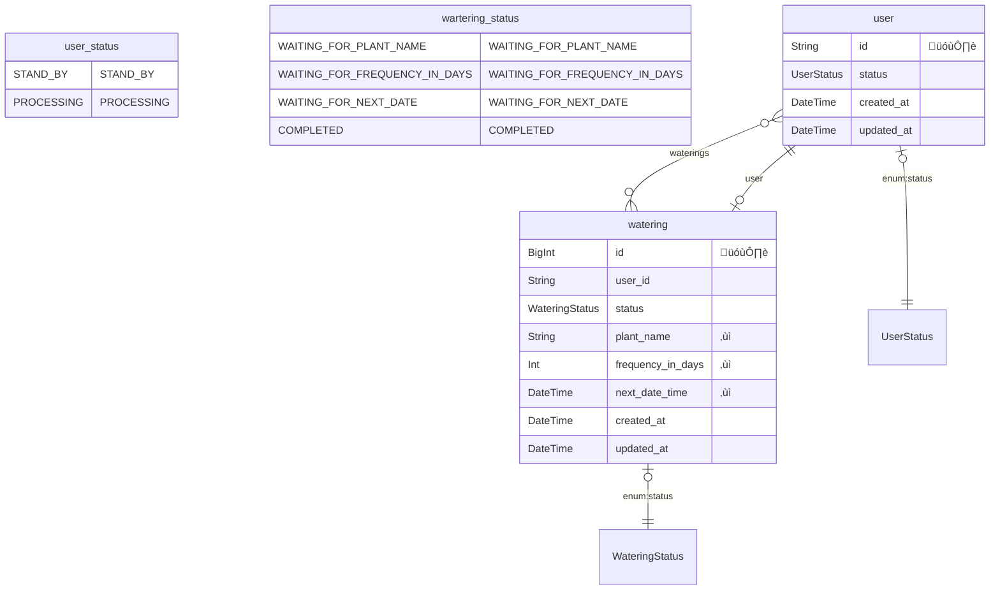

```mermaid
erDiagram

        user_status {
            STAND_BY STAND_BY
PROCESSING PROCESSING
        }
    


        wartering_status {
            WAITING_FOR_PLANT_NAME WAITING_FOR_PLANT_NAME
WAITING_FOR_FREQUENCY_IN_DAYS WAITING_FOR_FREQUENCY_IN_DAYS
WAITING_FOR_NEXT_DATE WAITING_FOR_NEXT_DATE
COMPLETED COMPLETED
        }
    
  "user" {
    String id "🗝️"
    UserStatus status 
    DateTime created_at 
    DateTime updated_at 
    }
  

  "watering" {
    BigInt id "🗝️"
    String user_id 
    WateringStatus status 
    String plant_name "‚ùì"
    Int frequency_in_days "‚ùì"
    DateTime next_date_time "‚ùì"
    DateTime created_at 
    DateTime updated_at 
    }
  
    "user" o|--|| "UserStatus" : "enum:status"
    "user" o{--}o "watering" : "waterings"
    "watering" o|--|| "WateringStatus" : "enum:status"
    "watering" o|--|| "user" : "user"
```
